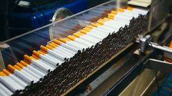

<!DOCTYPE html>
<html dir="ltr" lang="en-US"><head><!-- Created by Artisteer v4.1.0.59861 -->
    <meta charset="utf-8">
    <title>Main</title>
	<link rel="icon" type="image/ico" href="images/title-icon.png" />
    <meta name="viewport" content="initial-scale = 1.0, maximum-scale = 1.0, user-scalable = no, width = device-width">

    <!--[if lt IE 9]><![endif]-->
    <link rel="stylesheet" href="style.css" media="screen">
    <!--[if lte IE 7]><link rel="stylesheet" href="style.ie7.css" media="screen" /><![endif]-->
    <link rel="stylesheet" href="style.responsive.css" media="all">

    
    
    

</head>
<body>

    

<header class="art-header">

    

    

    

            

<h1 class="art-headline" data-left="70.39%">
    <a href="#">UNITED TOBACCO GROUP (UTG)</a>
</h1>

                
                    
</header>
<nav class="art-nav">
    <ul class="art-hmenu"><li><a href="main.html" class="active">Main</a></li><li><a href="products.html">Products</a></li><li><a href="contact-us.html">Contact Us</a></li><li><a href="about-us.html">About Us</a></li><li><a href="car-reviews.html">Articles</a></li></ul> 
    </nav>

                

                    

                        
<article class="art-post art-article">
                                
                                                
                

    

    

    

    

    

    

        United Tobacco Group is a tobacco manufacturing company that produces various brands for various clients. Our products range from the fully manufactured cigarettes to unprocessed raw tobacco depending on your needs. Our main target markets are tobacco processing companies, retailers and supermarkets that distribute tobacco products. 
    

    

    

    

        <h3>High Quality Products</h3>
We manufacture high quality tobacco products available for wholesale or retail at very low costs.We have a team of professional quality control workers who monitor the chain of processes from raw materials to finished products 

         
        
 

    

        <h3>Various Brands</h3>
         
        
We have a wide range of brands to choose from. Currently we have 4 brands, which are

<ul><li><a href="products.html" title="go to Products page">Yes</a> </li><li><a href="products.html" target="_self" title="go to Products page">Forum</a> </li><li><a href="products.html" title="go to Products page">Legends</a> </li><li><a href="products.html" target="_self" title="go to Products page" style="text-decoration: underline; font-weight: bold; font-style: italic; ">Supermatch</a> </li></ul>

We will introduce more brands in the near future according to people's demands

 

 

 

 

    

        <h3>Competitive Prices</h3>
         
        
We have a fast and efficient production line which enables us to present competitive prices on the market. 
		Since our production process is fast and effective, we sell our products at &nbsp;very reasonable prices. This gives us an edge over our competitors.

         
        
 

    

    

    

    

        <h3>Based on user feedback</h3>
We always adjust our product elementary proportions according to the feedback we get from end-users of our branded products. We have professionals who conduct some surveys as well as statical inference on the feedback data . 

 

    

        <h3>Reliable</h3>
Our services are reliable and we always strive to meet our customers needs in every circumstance 

 

 

    

        <h3>Wide coverage</h3>
We are currently &nbsp;operational in more three countries and we are still expanding. Our goal is to supply locally made tobacco products in all Southern African countries 

 

    

    

</article>

                    

                

            
<footer class="art-footer">

United Tobacco Group,Copyright © 2019, . All Rights Reserved.

</footer>

    

</body></html>